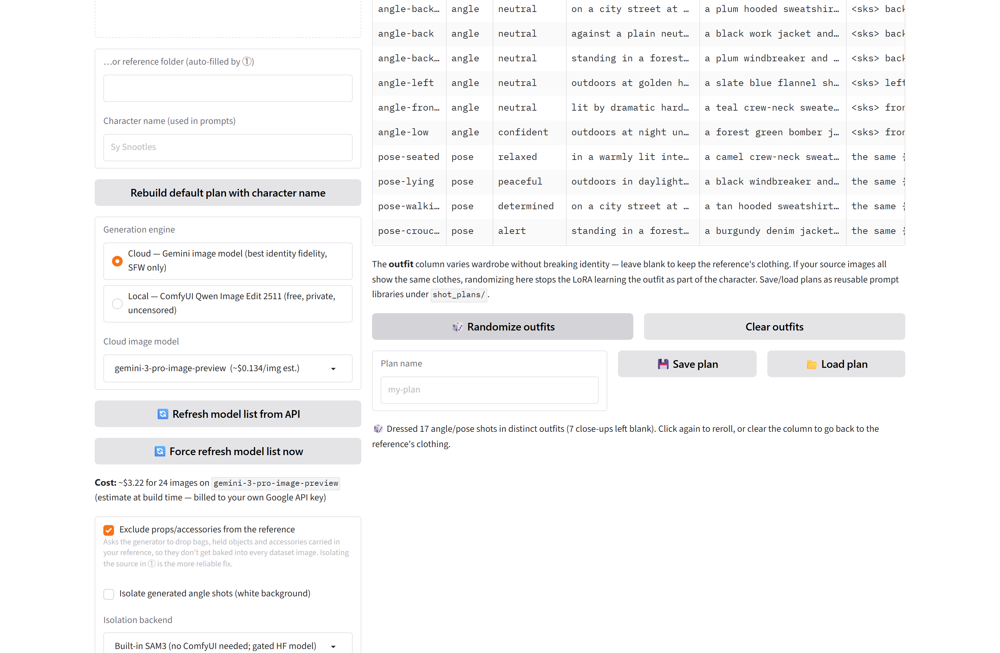

# LoRA Dataset Studio

**Turn a character, style, or concept into a ready-to-train LoRA dataset.** For a **character**,
one reference image becomes ~24 consistent shots across camera angles, poses, emotions and
settings. For a **style** or **concept**, bring your own images and get smart, correctly-framed
captions. Either way the output is a flat folder that drops straight into **ai-toolkit / kohya /
OneTrainer**, plus a ready-to-edit **training config**.



## Why use it

- **One reference → a full dataset.** No hunting for 24 angles of the same character — generate
  them, consistently, from a single image.
- **Character, style *or* concept.** Pick the **Dataset type** in the header; captions and
  defaults retune so the trigger learns an identity, an aesthetic, or an object/idea.
- **Local *or* cloud, per stage.** Every step has a free/private local path **and** a no-GPU
  cloud path. Mix and match: generate on the cloud, caption on your GPU, or the reverse.
- **Every stage is standalone.** Point any tab (or CLI subcommand) at any folder — preprocess
  only, caption only, export only. Bring your own images at any step.
- **Trainer-ready output.** Flat `NN.png` + `NN.txt`, `metadata.json`/`metadata.jsonl`, optional
  `.zip` and Hugging Face publish, and a generated config for Flux / SDXL / Qwen-Image / Krea /
  Pony and more.
- **Honest by design.** No telemetry, no upsell. Configs are generated and shown — **training is
  never launched for you**. Cloud calls bill *your* key; this tool takes no cut.

## The pipeline

**① Preprocess → ② Generate & curate → ③ Caption → ④ Export → ⑤ Train config**

Run them in order (each step auto-fills the next) or jump straight to the one you need.

| Stage | Local | Cloud |
|---|---|---|
| ① Restore / upscale | ComfyUI models, or basic Lanczos | — |
| ① Subject isolation | **Built-in SAM3** (no ComfyUI) or ComfyUI SAM3 | — |
| ② Generate shots | ComfyUI: Qwen Image Edit 2511 + Multiple-Angles LoRA | Gemini (Nano Banana) |
| ③ Caption | Qwen3-VL-8B, JoyCaption, NSFW finetune, **WD + e621 taggers**, LM Studio / Ollama / any OpenAI endpoint | Gemini Flash, Groq free tier |
| ④ Export | always local (+ optional **.zip** and **Hugging Face** publish) | — |
| ⑤ Train config | ai-toolkit (incl. SDXL) / **kohya sd-scripts** / musubi-tuner | — |

## Dataset types

Pick one in the header — it retunes caption framing, the ① isolation default, and the ⑤ sample
prompt. The trigger word is what the LoRA learns; captions describe everything *except* it.

| Type | Trigger learns | Captions describe | ② Generate |
|---|---|---|---|
| **Character** *(default)* | an identity | what *varies* (pose, angle, setting) | ✅ 24-shot set from one image |
| **Style** | an aesthetic / look | the image **content**, not the style/medium | bring your own images |
| **Concept** | an object, action or idea | the **context**, not the concept's fixed form | bring your own images |

Style adds an optional **sparse captions** toggle (trigger + a few words) for a stronger style at
the risk of the trigger absorbing content. Style/Concept skip ② — collect your own images and
start at **③ Caption**.

> 💡 **Need source images?** My separate **[YouTube Screenshot Extractor](https://github.com/EnragedAntelope/youtube-screenshot-extractor)**
> pulls high-quality frames from YouTube **and 1000+ other sites (and local video files)** — with
> automatic quality/blur filtering, scene detection and black-bar removal. It's a great way to
> gather a consistent style or concept set (or extra character references) to feed in here.

## Quick start

```text
# Windows                    # Linux / macOS
setup.bat                    ./setup.sh
start.bat                    ./start.sh
```

`setup.bat` asks whether to install the **NVIDIA-GPU (CUDA)** or **CPU-only** build — pick CPU
if you have no NVIDIA card and lean on the cloud options. Re-run it any time to switch. Then
open <http://127.0.0.1:7861>. Setup can store API keys in a gitignored `.env` — skip them all
and stay fully local, or add them later from [.env.example](.env.example).

> ### ⚠️ Costs & responsibility
>
> **Local options are free.** Cloud options are **billed directly to the API key you provide**
> (Gemini by Google; custom endpoints by whoever runs them; Groq's free tier is rate-limited).
> **This project never charges you and takes no cut.** In-app prices are build-time estimates —
> check [current Google pricing](https://ai.google.dev/pricing).
>
> You are **solely responsible** for the images you supply and everything you generate, caption,
> export or transmit. Use only images you have the rights to and follow each provider's policy.
> [MIT licensed](LICENSE), **no warranty**.

## Captioning

Point **③ Caption** at any folder, pick a captioner, get `.txt` sidecars. Every caption is
`{trigger}, {description}` — the description covers what *varies* (pose, angle, setting,
lighting), because identity is what the trigger learns.

**Caption style** — match your target base model:

- **Prose** *(default)* — natural language. Right for Flux, **Krea**, Qwen-Image, SDXL 3 and
  most modern text-encoders.
- **Danbooru tags** — a comma-separated tag list for SDXL, Illustrious, NoobAI and other
  Danbooru-trained checkpoints, which learn poorly from prose.
- **e621 tags** — the furry/anthro vocabulary for Pony Diffusion and furry checkpoints.

For **canonical** tags, pick a dedicated **tagger** (WD for Danbooru, Z3D for e621) — it reads
tags straight from the image rather than instructing a VLM (needs `onnxruntime`, installed by
setup). *Tag options* let you add a fixed **prefix/suffix** (e.g. Pony `score_9, score_8_up`),
**drop noisy tags** (`watermark`, `signature`…), append a **rating** tag, keep raw underscores,
tune tagger thresholds, and **skip already-captioned** images.

After captioning, a one-click **health check** flags empty, too-short, trigger-missing or
**identical** captions (the tell-tale of a captioner that returned junk) — and, for tag
datasets, the tags that appear on *nearly every image* so you know exactly what to feed the
drop-list. It's advisory: nothing is blocked or rewritten.

| Captioner | Runs on | Notes |
|---|---|---|
| Qwen3-VL-8B Instruct *(default)* | your GPU, ~17 GB | best instruction-following, NSFW-capable |
| JoyCaption Beta One | your GPU, ~17 GB | purpose-built diffusion captioner |
| Qwen3-VL-8B NSFW-Caption | your GPU, ~17 GB | explicit-dataset specialist |
| **WD EVA02 / ViT v3** *(tagger)* | GPU or CPU, ONNX | canonical **Danbooru** tags |
| **Z3D e621 ConvNeXt** *(tagger)* | GPU or CPU, ONNX | canonical **e621/furry** tags |
| Gemini Flash | Google API | SFW, ~$0.0007/img est., billed to your key |
| Groq Qwen3.6 27B | Groq API | SFW, free tier, rate-limited |
| LM Studio / Ollama / custom | your choice | any OpenAI-compatible endpoint |

## Two things that ruin a character LoRA

Both have a switch in ②, because both bit us:

- **Same clothes in every image** → the LoRA learns the outfit as the character. Hit
  **🎲 Randomize outfits** to dress each angle/pose shot differently.
- **Props copied into every shot** (a backpack in the reference → the LoRA thinks the backpack
  *is* the character). Best fix: **isolate the source in ①** — SAM3 keeps bags and held objects
  out of the subject mask. The "Exclude props" toggle in ② helps too, especially on Gemini.

## CLI

Every stage is a standalone subcommand; `--help` shows all options.

```bash
python cli.py preprocess ./sources --out ./prepped
python cli.py generate ./prepped --name "Sy Snootles" --engine comfyui --randomize-outfits
python cli.py caption ./folder --trigger sysnootles                       # prose sidecars
python cli.py caption ./folder --trigger sysnootles --caption-style tags  # Danbooru tags
python cli.py caption ./folder --trigger mystyle --dataset-type style     # style-framed
python cli.py caption ./folder --captioner wd-eva02 --drop-tags "watermark, signature"
python cli.py lint ./folder --trigger sysnootles                          # caption health report
python cli.py export ./prepped ./generated --name "Sy Snootles" --trigger sysnootles --zip
python cli.py build source.png --name "Sy Snootles" --trigger sysnootles  # all four stages
```

## API keys (cloud options only)

- **Gemini** — image generation and/or captioning: <https://aistudio.google.com/apikey>
- **Groq** — free-tier captioning: <https://console.groq.com/keys>
- **Hugging Face** (`HF_TOKEN`) — two uses:
  - **Built-in SAM3 isolation.** `facebook/sam3` is **gated**: accept the licence on the
    [model page](https://huggingface.co/facebook/sam3), wait for approval, then add a **read**
    token. Weights (~3.4 GB) download once.
  - **Publishing datasets to the Hub** (④, optional). Needs a **write** token; datasets are
    **private by default**.

## Good to know

- **No GPU?** Choose CPU-only in setup and use cloud generation + cloud captioning. The local
  8B captioners aren't practical on CPU (taggers are).
- **ComfyUI is optional** — only for local generation / model-based restoration. Cloud
  generation, built-in SAM3, local captioning and export all work without it. **No custom nodes
  required.** See [docs/comfyui-setup.md](docs/comfyui-setup.md).
- **Sources are never modified**; every stage writes copies.
- The UI binds to `127.0.0.1` with **no authentication** — don't expose it.
- Training configs are generated, never test-trained. Verify against your trainer's docs.
- **Update check:** one anonymous request to GitHub's public releases API on launch (cached
  24h); no data about you is sent. Disable with `LDS_UPDATE_CHECK_ENABLED=false`.

More detail: **[docs/ARCHITECTURE.md](docs/ARCHITECTURE.md)**.

## License

[MIT](LICENSE)
</content>
</invoke>
