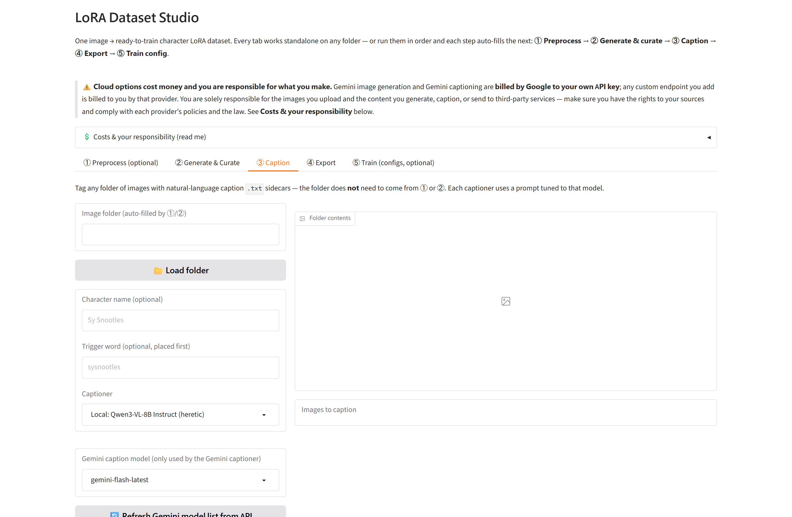

# LoRA Dataset Studio

Turn **one image** of a character into a **ready-to-train LoRA dataset**: ~24 consistent
shots across camera angles, poses, emotions and settings, each with a natural-language
caption, packaged in a flat folder that drops straight into **ai-toolkit / OneTrainer** —
plus a ready-to-edit **training config**.

**Every stage is standalone.** Point any tab (or CLI subcommand) at any folder: preprocess
only, generate only, caption only, export only. Run them in order and each step auto-fills
the next.

**Every stage has a local and a cloud path.** Fully local (private, free, uncensored) or
cloud (no GPU needed) — mix and match per stage.


> ### ⚠️ Costs & responsibility
>
> Local options are **free**. Cloud options are **billed directly to the API key you
> provide** — Gemini image generation and captioning by Google, custom endpoints by
> whoever runs them. Groq's free tier is rate-limited. **This project never charges you
> and takes no cut.** In-app prices are build-time estimates; check
> [current Google pricing](https://ai.google.dev/pricing).
>
> You are **solely responsible** for the images you supply and everything you generate,
> caption, export or transmit. Use only images you have the rights to, and follow each
> provider's acceptable-use policy. [MIT licensed](LICENSE), **no warranty**.

## Quick start

```text
# Windows                    # Linux / macOS
setup.bat                    ./setup.sh
start.bat                    ./start.sh
```

Then open <http://127.0.0.1:7861>. Setup offers to store API keys in a gitignored `.env`
— skip them all and stay fully local, or add them later from [.env.example](.env.example).

| Stage | Local | Cloud |
|---|---|---|
| ① Restore / upscale | ComfyUI models, or basic Lanczos | — |
| ① Subject isolation | **Built-in SAM3** (no ComfyUI) or ComfyUI SAM3 | — |
| ② Generate shots | ComfyUI: Qwen Image Edit 2511 + Multiple-Angles LoRA | Gemini (Nano Banana) |
| ③ Caption | Qwen3-VL-8B, JoyCaption, NSFW finetune, **WD taggers**, LM Studio / Ollama / any OpenAI-compatible endpoint | Gemini Flash, Groq free tier |
| ④ Export | always local (+ optional **.zip** and **Hugging Face** publish) | — |
| ⑤ Train config | ai-toolkit (incl. **SDXL**) / musubi-tuner | — |

## The five tabs

**① Preprocess** *(optional)* — restores/upscales degraded sources, cuts the subject out
onto white, and sizes everything to your target resolution.

**② Generate & curate** — 9 angles, 8 poses, 7 emotion close-ups, each with its own
setting so the dataset isn't 24 versions of the same standing shot. Edit any prompt,
save/load plans as reusable libraries, then generate. Uncheck rejects; blurry shots are
flagged automatically.

**③ Caption** — point at **any** folder, pick a captioner, write `.txt` sidecars. Choose
**prose**, **Danbooru tags** or **e621 tags** to match your target base model (tag-trained
checkpoints like SDXL / Illustrious / Pony want comma-separated tags, not prose). Test a
single caption first to compare captioners cheaply, and hand-edit any result inline.

**④ Export** — list your captioned folders, **Load & preview** to see every image with
its caption status (✓ / empty / missing), then **uncheck** anything you don't want and
export. You get a flat `NN.png` + `NN.txt` dataset with `metadata.json`. Optionally tick
**Also save a .zip** for a single upload-ready archive, or **publish to Hugging Face**
(private by default) straight from the tab.

**⑤ Train config** *(optional)* — inspects your dataset and writes an ai-toolkit
`config.yaml` or musubi `dataset.toml`, with steps and buckets derived from the images you
actually have. **Nothing is launched** — you get the config and the run command.



## Two things that ruin a character LoRA

Both have a switch in ②, because both bit us:

**Same clothes in every image** → the LoRA learns the outfit as part of the character.
Hit **🎲 Randomize outfits** to dress each angle/pose shot differently. (Close-ups stay
blank — clothing is barely in frame and describing it just widens the shot.)

**Props in the reference get copied into every shot** → 20 images with the same backpack
and your LoRA thinks the backpack *is* the character. Two defences:

1. **Isolate the source in ①.** This is the one that reliably works — SAM3 usually keeps
   bags and held objects out of the subject mask, so they never reach the generator.
2. **"Exclude props/accessories"** in ② (on by default) asks the generator to omit them.
   Effective on Gemini; less reliable locally, which is why isolation matters more.

> **Isolation tip:** the "objects to remove" prompt is usually **unnecessary** — SAM3
> generally excludes props on its own, and subtracting them again can only eat into your
> character. Try without it first; the log tells you whether it changed anything. Reach
> for it when a prop is genuinely fused into the subject (a microphone gripped in a hand).
> Where a prop *physically covers* the body, isolation leaves a real hole — no setting
> fixes that.

## CLI

```bash
python cli.py preprocess ./sources --out ./prepped
python cli.py generate ./prepped --name "Sy Snootles" --engine comfyui --randomize-outfits
python cli.py caption ./any/folder --trigger sysnootles     # writes .txt sidecars
python cli.py export ./prepped ./generated --name "Sy Snootles" --trigger sysnootles
python cli.py build source.png --name "Sy Snootles" --trigger sysnootles   # all four
```

Each subcommand is standalone; `--help` shows all options.

## Captioners

| Captioner | Runs on | Notes |
|---|---|---|
| Qwen3-VL-8B Instruct *(default)* | your GPU, ~17 GB | best instruction-following, NSFW-capable |
| JoyCaption Beta One | your GPU, ~17 GB | purpose-built diffusion captioner |
| Qwen3-VL-8B NSFW-Caption | your GPU, ~17 GB | explicit-dataset specialist |
| **WD EVA02-Large / ViT v3** *(tagger)* | GPU or CPU, ONNX ~0.4–1.4 GB | **canonical Danbooru tags** straight from the image — no VLM prose; needs `onnxruntime` |
| Gemini Flash | Google API | SFW, ~$0.0007/img est., billed to your key |
| Groq Qwen3.6 27B | Groq API | SFW, free tier, 8K TPM |
| LM Studio / Ollama / custom | your choice | any OpenAI-compatible endpoint |

Local models download from Hugging Face on first use. Add your own in `studio/config.py`.

**Caption style** — every captioner can emit any of:

- **Prose** *(default)* — one natural-language paragraph. Right for Flux, Qwen-Image,
  SDXL 3, and most newer text-encoders.
- **Danbooru tags** — a comma-separated tag list. Right for SDXL, Illustrious, NoobAI and
  other Danbooru-trained checkpoints, which learn poorly from prose.
- **e621 tags** — a comma-separated list in the furry/anthro vocabulary (species,
  `anthro`/`feral`, e621 conventions). Right for Pony Diffusion and furry checkpoints.

Danbooru and e621 are **different vocabularies**, not the same tags relabelled — pick the
one your base model was trained on. Either way the caption is `{trigger}, {description}` —
the description (prose *or* tags) covers what *varies* (pose, angle, setting, lighting),
not fixed appearance, because identity is what the trigger learns. Pick it on the ③ Caption
tab, or `--caption-style prose|tags|e621` on the CLI.

> **Tag accuracy:** the *VLM* captioners with a tag style *instruct* a general model to
> produce tags, so the output approximates the vocabulary rather than matching a controlled
> tag set exactly (JoyCaption, trained on Danbooru + e621, does best). For **canonical
> Danbooru tags**, pick a **WD tagger** captioner instead — it reads tags directly from the
> image (needs `onnxruntime`; it ignores the prose/tags/e621 selector).

## API keys (cloud options only)

- **Gemini** — image generation and/or captioning. Key: <https://aistudio.google.com/apikey>
- **Groq** — free-tier captioning. Key: <https://console.groq.com/keys>
- **Hugging Face** (`HF_TOKEN` in `.env`) — two uses:
  - **Built-in SAM3 isolation.** `facebook/sam3` is **gated and manually approved**: accept
    the licence on the [model page](https://huggingface.co/facebook/sam3), wait for
    approval, then put a **read** token in `.env`. Weights (~3.4 GB) download once.
  - **Publishing datasets to the Hub** (④, optional). Needs a **write** token. Datasets are
    created **private by default**; you are responsible for the rights to what you upload.

## ComfyUI (optional)

Only needed for local generation or model-based restoration — cloud generation, built-in
SAM3, local captioning and export all work without it. See
**[docs/comfyui-setup.md](docs/comfyui-setup.md)** for models. **No custom nodes are
required**; the bundled workflows use only core ComfyUI nodes.

If your ComfyUI queue is busy, tick **"Prioritize this app's ComfyUI jobs"** to jump the
pending queue (it won't interrupt a job already running).

## Good to know

- **No GPU?** Cloud generation + cloud captioning. Local 8B captioners aren't practical on CPU.
- **Rear views are chained** (`chain_from`): back shots build on a generated side view,
  because direct front→back generation hallucinates on unusual characters.
- **Sources are never modified**; every stage writes copies.
- The UI binds to `127.0.0.1` with **no authentication** — don't expose it.
- Training configs are generated, never test-trained. Verify against your trainer's docs
  before a long run.
- **Update check:** on launch the app makes one anonymous request to GitHub's public
  releases API to see if a newer version is out, and shows a small dismissible banner if
  so — no data about you or your usage is sent. Result is cached 24h in
  `.cache/update_check.json`. Set `LDS_UPDATE_CHECK_ENABLED=false` (in `.env`) to disable
  it entirely, no network call at all.

More detail: **[docs/ARCHITECTURE.md](docs/ARCHITECTURE.md)**.

## License

[MIT](LICENSE)
